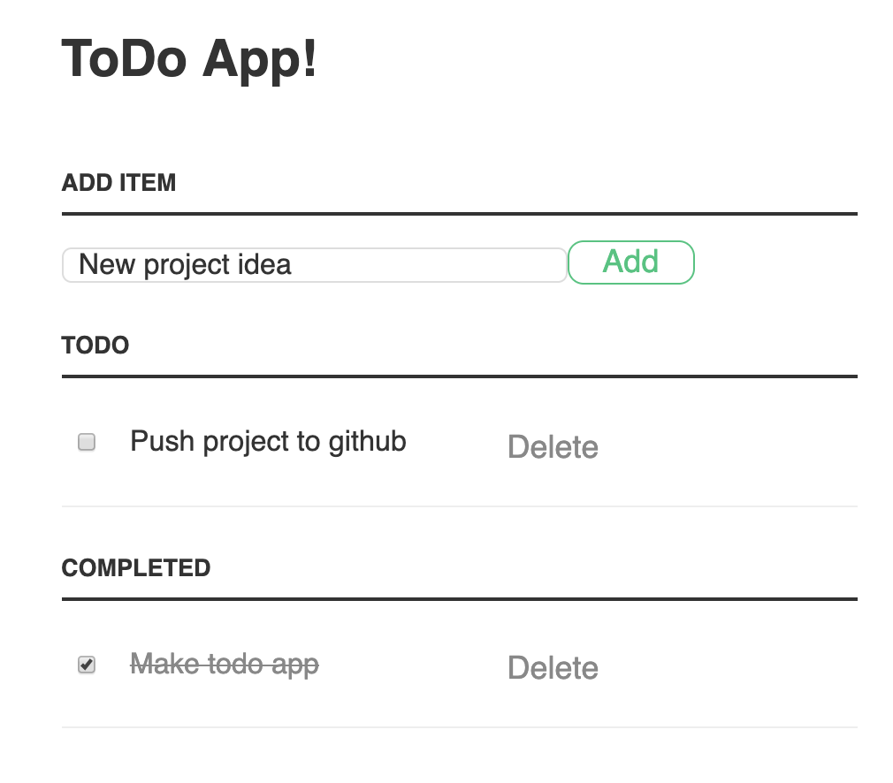
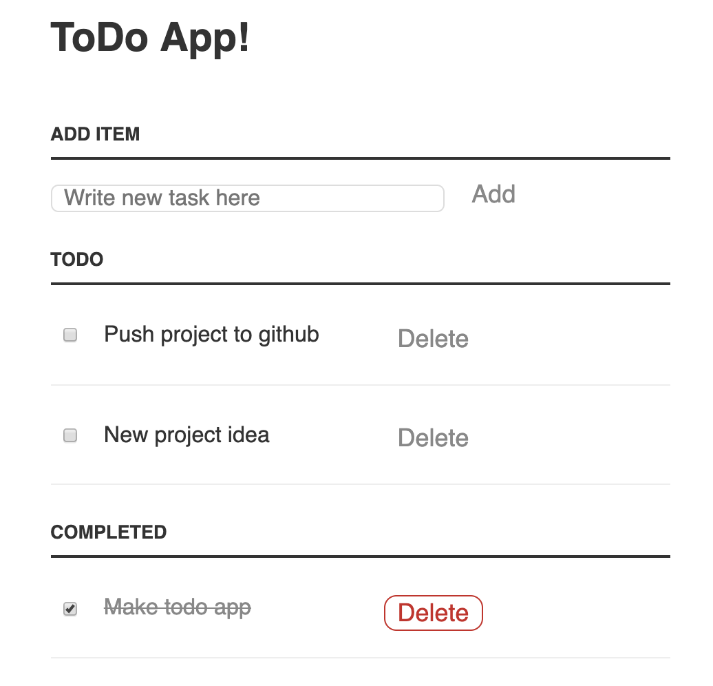

# A simple todo app

## Description
This is a classic Todo app - no backend implemented, nor any frameworks or libraries. Every task that is added is stored in an array which in turn is stored as an object in the local storage. The app uses this object to display the tasks. The view of the app is therefore dependent on the state object (and not the other way around).

### UI
* Initially, the list of todo tasks is empty.
* There is a form where the user can add a new 'todo'.
* When a new todo task is submitted from the form, a new todo card is appended to the list.
* Clicking on a todo card is visually mark the card as done and a remove-button is added. When the button is clicked, the card is removed from the board (i.e. the local storage).
* Cards marked as 'done' are moved to the completed section of the list.
__________________________________________________________________________________
Screenshots from my app.

Add button on hover:

Delete button on hover:

